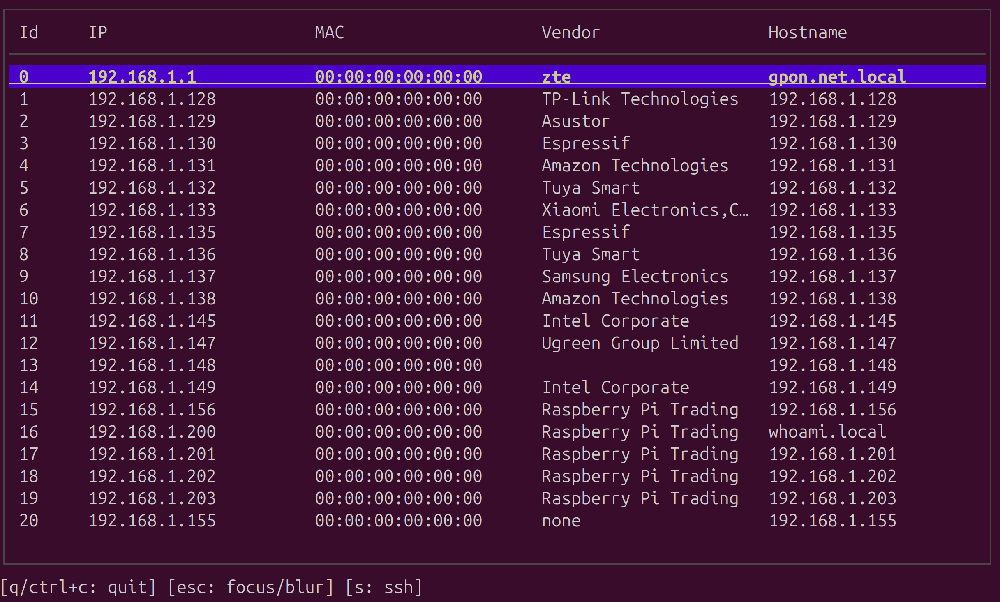

# nls

A fast, terminal-based network scanner that lists hosts in a network using nmap's ping scan. Results are displayed in an interactive terminal UI for easy browsing.



## Download
Download the latest release for Linux (amd64/arm64) or macOS (arm64) from the [Releases page](https://github.com/xafardero/nls/releases).

```sh
# Replace {OS}-{ARCH} with your platform (e.g., linux-amd64, macos-arm64)
curl -L https://github.com/xafardero/nls/releases/download/v0.1.4/nls-{OS}-{ARCH} -o nls
chmod +x nls
sudo mv nls /usr/local/bin/
```

Now you can run `nls` from anywhere.

## Build from source
```sh
git clone https://github.com/xafardero/nls.git
cd nls
go build -o nls ./cmd/nls
```

## Usage
Run as root (required for nmap ping scan):

```sh
sudo nls [CIDR]
```
- If no CIDR is specified, defaults to `192.168.1.0/24`
- Example: `sudo nls 10.0.0.0/24`

**Keyboard Shortcuts:**

**Navigation:**
- `↑`/`↓` or `j`/`k`: Navigate table
- `esc`: Toggle table focus

**Actions:**
- `s`: SSH to selected host
- `y`: Copy IP to clipboard
- `m`: Copy MAC address to clipboard
- `h`: Copy hostname to clipboard
- `a`: Copy all fields to clipboard (tab-separated)
- `r`: Rescan network (refreshes host list)

**Search & Sort:**
- `/`: Search/filter hosts (matches IP, MAC, Vendor, or Hostname)
- `1`: Sort by IP address
- `2`: Sort by MAC address
- `3`: Sort by Vendor
- `4`: Sort by Hostname
- Press the same number again to toggle ascending/descending

**Help & Exit:**
- `?`: Show help screen with all shortcuts
- `q` or `ctrl+c`: Quit

## Features
- Fast network scanning using nmap's ping scan
- Interactive terminal UI with keyboard navigation
- Displays IP, MAC address, vendor, and hostname for each host
- Live search/filter across all fields
- Column sorting with visual indicators (↑/↓)
- Rescan network without restarting the application
- Copy any field to clipboard
- Built-in help screen

---
MIT License
